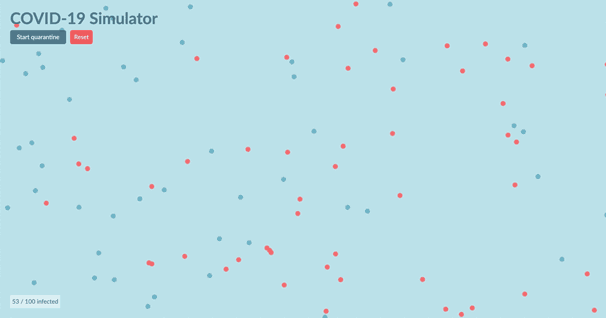

# COVID-19 Simulator #

> HTML5 particles collision detection to simulate the spread of COVID-19.

### Installation ###

* `yarn install`

### Dev Server ###

* `yarn dev`

### Build Production ###

All the build files can be found in `/dist` folder.

* `yarn build`

### Tech Stack ###

* Pug
* CSS3
* JavaScript
* HTML% Canvas

### Change Log ###
* Click [here](CHANGELOG.md) to view change log
